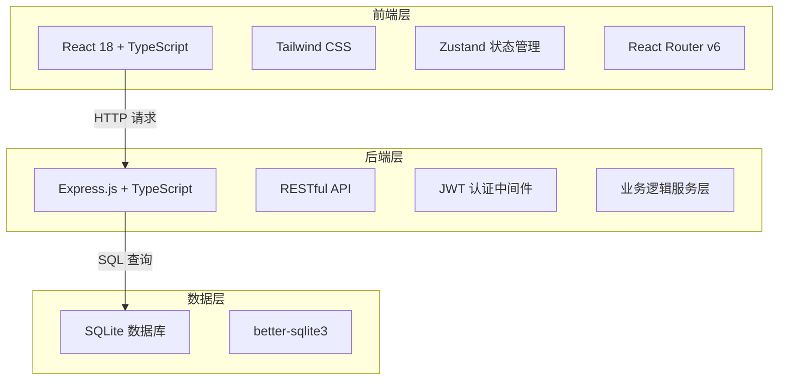
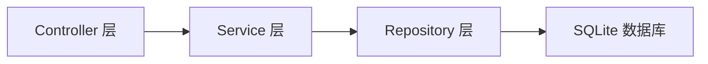
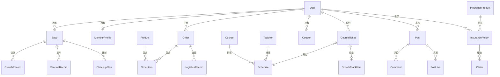

## 1. 架构设计



## 2. 技术说明

- **前端**: React@18 + TailwindCSS@3 + Vite + Zustand + React Router v6
- **初始化工具**: vite-init (react-express-ts 模板)
- **后端**: Express@4 + TypeScript (ESM)
- **数据库**: SQLite (better-sqlite3)，使用 mock 数据初始化
- **图标**: lucide-react
- **图表**: recharts
- **日期处理**: dayjs

## 3. 路由定义

| 路由 | 用途 |
|------|------|
| `/` | 首页 - 平台导航、智能推荐、活动Banner |
| `/login` | 登录/注册页 |
| `/baby` | 宝宝档案列表页 |
| `/baby/:id` | 宝宝档案详情页(含疫苗、体检、成长曲线) |
| `/shop` | 母婴商城首页(分类+商品列表) |
| `/shop/product/:id` | 商品详情页 |
| `/shop/cart` | 购物车页 |
| `/shop/order/:id` | 订单详情页(含物流) |
| `/shop/orders` | 订单列表页 |
| `/education` | 早教中心首页(课程分类) |
| `/education/course/:id` | 课程详情页(含预约) |
| `/education/tickets` | 我的课程票 |
| `/education/growth` | 成长轨迹 |
| `/community` | 育儿社区首页 |
| `/community/post/:id` | 动态详情页 |
| `/community/publish` | 发布动态页 |
| `/insurance` | 母婴保险首页(产品列表) |
| `/insurance/product/:id` | 保险产品详情页 |
| `/insurance/claim` | 理赔申请页 |
| `/insurance/claims` | 我的理赔列表 |
| `/member` | 会员中心 |
| `/admin` | 管理看板 |
| `/admin/prediction` | 智能预测与报表 |

## 4. API 定义

### 4.1 认证相关

```typescript
POST /api/auth/register
  Request: { phone: string; code: string; name: string }
  Response: { token: string; user: User }

POST /api/auth/login
  Request: { phone: string; code: string }
  Response: { token: string; user: User }

GET /api/auth/me
  Headers: { Authorization: Bearer <token> }
  Response: User
```

### 4.2 宝宝档案

```typescript
GET /api/babies
  Response: Baby[]

POST /api/babies
  Request: { name: string; gender: "male"|"female"; birthDate: string; avatar?: string }
  Response: Baby

PUT /api/babies/:id
  Request: { name?: string; gender?: string; birthDate?: string; avatar?: string }
  Response: Baby

DELETE /api/babies/:id
  Response: { success: boolean }

POST /api/babies/:id/growth
  Request: { height: number; weight: number; date: string }
  Response: GrowthRecord

GET /api/babies/:id/growth
  Response: GrowthRecord[]

POST /api/babies/:id/vaccines
  Request: { vaccineName: string; date: string; hospital?: string }
  Response: VaccineRecord

GET /api/babies/:id/vaccines
  Response: VaccineRecord[]

GET /api/babies/:id/vaccine-plan
  Response: { recommended: VaccinePlan[]; upcoming: VaccinePlan[] }

GET /api/babies/:id/checkup-plan
  Response: CheckupPlan[]
```

### 4.3 商城

```typescript
GET /api/products?category=string&age=number&keyword=string&page=number
  Response: { products: Product[]; total: number; page: number }

GET /api/products/:id
  Response: Product

GET /api/cart
  Response: CartItem[]

POST /api/cart
  Request: { productId: number; quantity: number; spec?: string }
  Response: CartItem

PUT /api/cart/:id
  Request: { quantity: number }
  Response: CartItem

DELETE /api/cart/:id
  Response: { success: boolean }

POST /api/orders
  Request: { addressId: number; items: CartItem[]; paymentMethod: string }
  Response: Order

GET /api/orders
  Response: Order[]

GET /api/orders/:id
  Response: Order & { logistics: LogisticsRecord[] }
```

### 4.4 早教中心

```typescript
GET /api/courses?category=string&teacherId=number
  Response: Course[]

GET /api/courses/:id
  Response: Course & { teacher: Teacher; schedules: Schedule[] }

POST /api/courses/:id/book
  Request: { scheduleId: number; date: string }
  Response: CourseTicket

GET /api/tickets
  Response: CourseTicket[]

POST /api/tickets/:id/checkin
  Request: { code: string }
  Response: { success: boolean; message: string }

GET /api/growth-track
  Response: GrowthTrackItem[]
```

### 4.5 育儿社区

```typescript
GET /api/posts?tag=string&sort=hot|new&page=number
  Response: { posts: Post[]; total: number }

GET /api/posts/:id
  Response: Post & { comments: Comment[] }

POST /api/posts
  Request: { content: string; images: string[]; tags: string[] }
  Response: Post

POST /api/posts/:id/like
  Response: { liked: boolean; likeCount: number }

POST /api/posts/:id/comments
  Request: { content: string }
  Response: Comment
```

### 4.6 母婴保险

```typescript
GET /api/insurance/products
  Response: InsuranceProduct[]

GET /api/insurance/products/:id
  Response: InsuranceProduct

POST /api/insurance/purchase
  Request: { productId: number; insured: InsuredInfo; premium: number }
  Response: InsurancePolicy

POST /api/insurance/claims
  Request: { policyId: number; amount: number; documents: string[]; description: string }
  Response: Claim

GET /api/insurance/claims
  Response: Claim[]

PUT /api/insurance/claims/:id/review
  Request: { approved: boolean; note?: string }
  Response: Claim
```

### 4.7 会员体系

```typescript
GET /api/member/profile
  Response: MemberProfile

GET /api/member/coupons
  Response: Coupon[]

GET /api/member/upgrade-progress
  Response: { currentLevel: string; nextLevel: string; spendingProgress: number; activityProgress: number }
```

### 4.8 管理看板

```typescript
GET /api/admin/dashboard?city=string&startDate=string&endDate=string
  Response: DashboardData

GET /api/admin/prediction
  Response: PredictionData

GET /api/admin/report?month=string
  Response: ReportData
```

## 5. 服务器架构图



## 6. 数据模型

### 6.1 数据模型定义



### 6.2 数据定义语言

```sql
CREATE TABLE users (
  id INTEGER PRIMARY KEY AUTOINCREMENT,
  phone TEXT UNIQUE NOT NULL,
  name TEXT NOT NULL,
  avatar TEXT,
  role TEXT DEFAULT 'user' CHECK(role IN ('user','teacher','admin')),
  created_at TEXT DEFAULT (datetime('now'))
);

CREATE TABLE babies (
  id INTEGER PRIMARY KEY AUTOINCREMENT,
  user_id INTEGER NOT NULL REFERENCES users(id),
  name TEXT NOT NULL,
  gender TEXT NOT NULL CHECK(gender IN ('male','female')),
  birth_date TEXT NOT NULL,
  avatar TEXT,
  created_at TEXT DEFAULT (datetime('now'))
);

CREATE TABLE growth_records (
  id INTEGER PRIMARY KEY AUTOINCREMENT,
  baby_id INTEGER NOT NULL REFERENCES babies(id),
  height REAL NOT NULL,
  weight REAL NOT NULL,
  record_date TEXT NOT NULL,
  created_at TEXT DEFAULT (datetime('now'))
);

CREATE TABLE vaccine_records (
  id INTEGER PRIMARY KEY AUTOINCREMENT,
  baby_id INTEGER NOT NULL REFERENCES babies(id),
  vaccine_name TEXT NOT NULL,
  vaccinated_date TEXT,
  hospital TEXT,
  status TEXT DEFAULT 'pending' CHECK(status IN ('pending','completed','overdue')),
  created_at TEXT DEFAULT (datetime('now'))
);

CREATE TABLE products (
  id INTEGER PRIMARY KEY AUTOINCREMENT,
  name TEXT NOT NULL,
  category TEXT NOT NULL,
  price REAL NOT NULL,
  original_price REAL,
  image TEXT,
  description TEXT,
  age_min INTEGER,
  age_max INTEGER,
  stock INTEGER DEFAULT 0,
  sales INTEGER DEFAULT 0,
  warehouse_city TEXT,
  created_at TEXT DEFAULT (datetime('now'))
);

CREATE TABLE cart_items (
  id INTEGER PRIMARY KEY AUTOINCREMENT,
  user_id INTEGER NOT NULL REFERENCES users(id),
  product_id INTEGER NOT NULL REFERENCES products(id),
  quantity INTEGER DEFAULT 1,
  spec TEXT,
  created_at TEXT DEFAULT (datetime('now'))
);

CREATE TABLE orders (
  id INTEGER PRIMARY KEY AUTOINCREMENT,
  user_id INTEGER NOT NULL REFERENCES users(id),
  total_amount REAL NOT NULL,
  status TEXT DEFAULT 'pending' CHECK(status IN ('pending','paid','shipped','delivered','cancelled')),
  address TEXT NOT NULL,
  city TEXT,
  warehouse TEXT,
  payment_method TEXT,
  created_at TEXT DEFAULT (datetime('now'))
);

CREATE TABLE order_items (
  id INTEGER PRIMARY KEY AUTOINCREMENT,
  order_id INTEGER NOT NULL REFERENCES orders(id),
  product_id INTEGER NOT NULL REFERENCES products(id),
  quantity INTEGER NOT NULL,
  price REAL NOT NULL,
  spec TEXT
);

CREATE TABLE logistics_records (
  id INTEGER PRIMARY KEY AUTOINCREMENT,
  order_id INTEGER NOT NULL REFERENCES orders(id),
  status TEXT NOT NULL,
  description TEXT,
  location TEXT,
  created_at TEXT DEFAULT (datetime('now'))
);

CREATE TABLE teachers (
  id INTEGER PRIMARY KEY AUTOINCREMENT,
  name TEXT NOT NULL,
  avatar TEXT,
  rating REAL DEFAULT 0,
  specialty TEXT,
  bio TEXT
);

CREATE TABLE courses (
  id INTEGER PRIMARY KEY AUTOINCREMENT,
  name TEXT NOT NULL,
  category TEXT NOT NULL,
  teacher_id INTEGER REFERENCES teachers(id),
  cover_image TEXT,
  description TEXT,
  price REAL NOT NULL,
  duration INTEGER,
  age_min INTEGER,
  age_max INTEGER,
  rating REAL DEFAULT 0
);

CREATE TABLE schedules (
  id INTEGER PRIMARY KEY AUTOINCREMENT,
  course_id INTEGER NOT NULL REFERENCES courses(id),
  teacher_id INTEGER NOT NULL REFERENCES teachers(id),
  date TEXT NOT NULL,
  start_time TEXT NOT NULL,
  end_time TEXT NOT NULL,
  capacity INTEGER DEFAULT 10,
  booked INTEGER DEFAULT 0
);

CREATE TABLE course_tickets (
  id INTEGER PRIMARY KEY AUTOINCREMENT,
  user_id INTEGER NOT NULL REFERENCES users(id),
  schedule_id INTEGER NOT NULL REFERENCES schedules(id),
  course_id INTEGER NOT NULL REFERENCES courses(id),
  status TEXT DEFAULT 'active' CHECK(status IN ('active','used','expired','cancelled')),
  qr_code TEXT,
  created_at TEXT DEFAULT (datetime('now'))
);

CREATE TABLE growth_track_items (
  id INTEGER PRIMARY KEY AUTOINCREMENT,
  ticket_id INTEGER NOT NULL REFERENCES course_tickets(id),
  baby_id INTEGER NOT NULL REFERENCES babies(id),
  teacher_comment TEXT,
  checkin_time TEXT,
  created_at TEXT DEFAULT (datetime('now'))
);

CREATE TABLE posts (
  id INTEGER PRIMARY KEY AUTOINCREMENT,
  user_id INTEGER NOT NULL REFERENCES users(id),
  content TEXT NOT NULL,
  images TEXT,
  tags TEXT,
  like_count INTEGER DEFAULT 0,
  comment_count INTEGER DEFAULT 0,
  created_at TEXT DEFAULT (datetime('now'))
);

CREATE TABLE comments (
  id INTEGER PRIMARY KEY AUTOINCREMENT,
  post_id INTEGER NOT NULL REFERENCES posts(id),
  user_id INTEGER NOT NULL REFERENCES users(id),
  content TEXT NOT NULL,
  created_at TEXT DEFAULT (datetime('now'))
);

CREATE TABLE post_likes (
  id INTEGER PRIMARY KEY AUTOINCREMENT,
  post_id INTEGER NOT NULL REFERENCES posts(id),
  user_id INTEGER NOT NULL REFERENCES users(id),
  UNIQUE(post_id, user_id)
);

CREATE TABLE insurance_products (
  id INTEGER PRIMARY KEY AUTOINCREMENT,
  name TEXT NOT NULL,
  type TEXT NOT NULL CHECK(type IN ('accident','critical_illness')),
  coverage_amount REAL NOT NULL,
  premium REAL NOT NULL,
  age_min INTEGER,
  age_max INTEGER,
  description TEXT,
  features TEXT
);

CREATE TABLE insurance_policies (
  id INTEGER PRIMARY KEY AUTOINCREMENT,
  user_id INTEGER NOT NULL REFERENCES users(id),
  product_id INTEGER NOT NULL REFERENCES insurance_products(id),
  insured_name TEXT NOT NULL,
  insured_id TEXT NOT NULL,
  premium REAL NOT NULL,
  status TEXT DEFAULT 'active' CHECK(status IN ('active','expired','cancelled')),
  start_date TEXT,
  end_date TEXT,
  created_at TEXT DEFAULT (datetime('now'))
);

CREATE TABLE claims (
  id INTEGER PRIMARY KEY AUTOINCREMENT,
  policy_id INTEGER NOT NULL REFERENCES insurance_policies(id),
  user_id INTEGER NOT NULL REFERENCES users(id),
  amount REAL NOT NULL,
  documents TEXT,
  description TEXT,
  status TEXT DEFAULT 'initial_review' CHECK(status IN ('initial_review','escalated','approved','rejected','paid')),
  review_note TEXT,
  created_at TEXT DEFAULT (datetime('now')),
  reviewed_at TEXT
);

CREATE TABLE member_profiles (
  id INTEGER PRIMARY KEY AUTOINCREMENT,
  user_id INTEGER UNIQUE NOT NULL REFERENCES users(id),
  level TEXT DEFAULT 'normal' CHECK(level IN ('normal','silver','gold','diamond')),
  annual_spending REAL DEFAULT 0,
  activity_score INTEGER DEFAULT 0,
  points INTEGER DEFAULT 0,
  updated_at TEXT DEFAULT (datetime('now'))
);

CREATE TABLE coupons (
  id INTEGER PRIMARY KEY AUTOINCREMENT,
  user_id INTEGER NOT NULL REFERENCES users(id),
  type TEXT NOT NULL,
  value REAL NOT NULL,
  min_spend REAL DEFAULT 0,
  status TEXT DEFAULT 'available' CHECK(status IN ('available','used','expired')),
  expires_at TEXT,
  created_at TEXT DEFAULT (datetime('now'))
);
```
